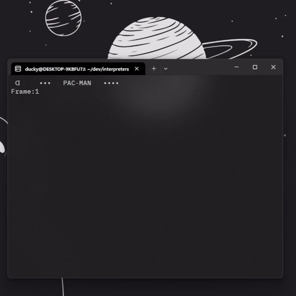
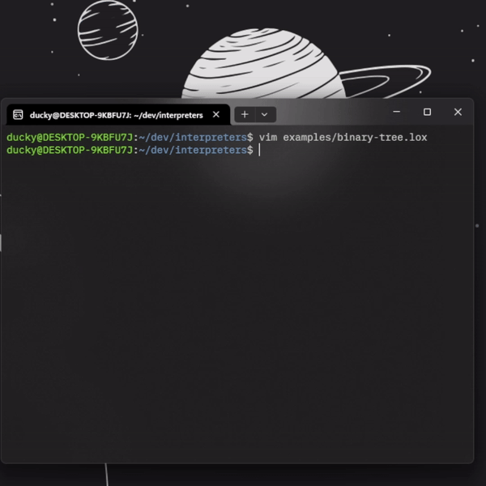

# A tree-walk interpreter for the Lox language, built with Java using Bob Nystrom's book "Crafting Interpreters."
Lox is a simple interpreted, dynamically typed, general-purpose programming language that supports OOP to a limited extend. 

This project is based on JLox, with a few added features.

It leverages the JVM to support:
- Expressions, statements, and control flow structures.
- First-class functions.
- Classes and single inheritance.
- Garbage collection.
- Static and runtime error handling.




[designDocs](designDocs) is used to keep track of changes as the project progresses to its final form.

## Table of Contents
- [Setup](#setup)
- [Testing](#testing)
- [Basics](#basics)
- [Titbits](#titbits)

## Getting Started
### Setup
Compiling and testing the interpreter is done through makefile scripts. You can clone the repo and run `make` to setup JDK and compile the project.

After, you can either try the interpreter in REPL mode.
```
./jlox
```
Or pass an argument to the script
```
./jlox add.lox
```
### Testing
Tests are setup through `make` scripts that runs the interpreter with `.test.lox` files under `/test` against `.result.lox` files. 

If you want to mess around with the project and want to make sure it stil works correctly, run `make test` or `make test FLAG=verbose` for more details.

### Basics
Currently, Lox supports 8 data types:
- nil
- boolean
- int
- double
- string
- array
- functions / native functions (`clock()`)
- classes

Variable and function are declared with the keyword `var` and `fun` respectively. <br>
```
var counter = 0;
fun makeCounter() {}
```
(do note that variables are not hoisted!)

Functions:
- Are first-class, so they are treated like other values.
- Take in parameters and return a value.
- Can create side-effects (like print to console).
- Have a reference to its outer scope to create closure.
```
fun makeCounter() {
  var i = 0;
  fun count() {
    i = i + 1;
    print i;
  }
  return count;
}
```

Lox supports OOP features, so it also has classes with properties and methods, inheritance, constructors, `this` and `super`.

```
class Doughnut {
  cook() {
    print "Fry until golden brown.";
  }
}

class BostonCream < Doughnut {
  cook() {
    super.cook();
    print "Pipe full of custard and coat with chocolate.";
  }
}

BostonCream().cook();
```
Lox class is a collection of functions, no properties. Properties of a class is declared inside the constructor:
```
init() {
  this.beverage = "cola";
}
```
New array is called by calling the native function `Array(2)` and pass in the size of the array.
```
var arr = Array(5);

var i = 0;

while (i < arr.length) {
        arr.set(i, i);
        i = i + 1;
}
```
### Native functions
- `clock()`: use to get the current time in seconds.
- `clear()`: use to clear the console.
- `Array()`: use to create a new array.
- `sleep()`: pause runtime execution.

### Titbits
The complete syntax of Lox can be found [here](https://craftinginterpreters.com/appendix-i.html).

The currect project supports the following basic escape sequences
- `\n`
- `\t`
- `\r`
- `\b`
- `\\`

Strings are characters surrounded by double quotes, single quotes are not allowed, as well as using double quote character as a string literal.

While both integer and double are supported, at runtime they are treated as double. Arithmetic operations between Number operands will implicitly convert those operands to double, with the exception of `PLUS` that will convert a Number operand to String if the other operand is a String.
```
var x = 1;
var y = 2.5;
print y-x; // 0.5
```
```
fun isEven(n) {
  if (n == 0) return true; // n here is a double, as such
  return isOdd(n - 1); // n - 1 returns a double
}

fun isOdd(n) {
  if (n == 0) return false;
  return isEven(n - 1);
}

print isEven(4); // true
print isOdd(3); // true
```

What happens when something other than an Integer is passed to `Array()`? Instead of reporting a runtime error, I thought it would be fun to do what JS does, by creating an array with the only element being the argument passed (and it's less hassle this way, reporting runtime error requires access to ast by design and native functions don't have that...)
```
var arr = Array("uh...");
print arr.length; // 1
print arr.get(0) // uh...
```

The quickest way to break the interpreter is to run an infinite loop... for now the parser doesn't detect that sort of thing nor does the runtime have handles for it, so..

### TODO:
    - [ ] add detection for infinite loop
    - [ ] add more example for lox
    - [ ] compile java byte code to WebAssembly to create an online playground